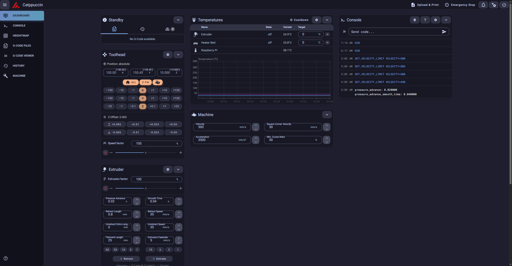

# 🌸 Catppuccin Mocha Theme for Mainsail

<p align="center">
  
</p>

<p align="center">
  <i>A soothing pastel theme for Mainsail 3D printer management interface</i>
</p>

## 🎨 Preview



This theme transforms your Mainsail interface with the beautiful Catppuccin Mocha color palette, featuring:

- **Soothing dark backgrounds** with proper contrast ratios
- **Elegant color-coded status indicators** for printer states and temperatures  
- **Smooth animations and transitions** for enhanced user experience
- **Accessibility-first design** with proper focus indicators and readable text
- **Responsive layout** that works beautifully on all screen sizes

## 🚀 Installation

### Method 1: Via Mainsail File Manager (Recommended)

1. **Access Mainsail File Manager:**
   - Open Mainsail in your browser
   - Navigate to `Settings > Machine` 
   - Enable "Show Hidden Files" in the file manager

2. **Create Theme Directory:**
   - Create a new folder named `.theme` (note the leading dot)
   - Upload `custom.css` to the `.theme` folder

3. **Apply Theme:**
   - The theme will be automatically applied
   - Refresh your browser to see the changes

### Method 2: Via SSH/File Transfer

1. **Connect to your printer:**
   ```bash
   ssh pi@your-printer-ip
   ```

2. **Navigate to Klipper config:**
   ```bash
   cd ~/printer_data/config
   # or for older installations: cd ~/klipper_config
   ```

3. **Create theme directory and upload:**
   ```bash
   mkdir -p .theme
   # Upload custom.css to .theme directory
   ```

## 🎯 Features

### 🌈 Complete Color Theming
- **Base Colors:** Deep, comfortable backgrounds that reduce eye strain
- **Accent Colors:** Beautiful blue primary with mauve accents
- **Status Colors:** Intuitive color coding for printer states
- **Text Colors:** High contrast text with proper readability

### ✨ Enhanced UI Elements
- **Cards:** Rounded corners with subtle shadows and hover effects
- **Buttons:** Smooth transitions with hover animations
- **Navigation:** Elegant sidebar with active state indicators
- **Forms:** Clean input fields with focus states
- **Tables:** Alternating row colors with hover highlights

### 🎭 Smart Status Indicators
```css
/* Temperature ranges with intuitive colors */
.temperature-cold    /* Sky blue for cold */
.temperature-warm    /* Yellow for warm */
.temperature-hot     /* Peach for hot */
.temperature-danger  /* Red for dangerous temperatures */

/* Printer status with clear visual cues */
.status-ready       /* Green for ready */
.status-printing    /* Blue for active printing */
.status-paused      /* Yellow for paused */
.status-error       /* Red for errors */
.status-offline     /* Muted for offline */
```

### ♿ Accessibility Features
- **High contrast ratios** meeting WCAG guidelines
- **Focus indicators** for keyboard navigation
- **Readable font sizes** and spacing
- **Color-blind friendly** status indicators

## 🛠️ Customization

### Changing Accent Colors

Want a different accent color? Update these CSS variables in `custom.css`:

```css
:root {
  /* Change primary color from blue to any other Catppuccin color */
  --v-primary-base: var(--ctp-mauve) !important;  /* Purple theme */
  --v-primary-base: var(--ctp-green) !important;  /* Green theme */
  --v-primary-base: var(--ctp-peach) !important;  /* Orange theme */
}
```

### Available Catppuccin Mocha Colors

| Color | Hex | Use Case |
|-------|-----|----------|
| Rosewater | `#f5e0dc` | Subtle highlights |
| Flamingo | `#f2cdcd` | Soft accents |
| Pink | `#f5c2e7` | Fun highlights |
| Mauve | `#cba6f7` | Purple accents |
| Red | `#f38ba8` | Errors, alerts |
| Maroon | `#eba0ac` | Alternative red |
| Peach | `#fab387` | Warnings, hot temps |
| Yellow | `#f9e2af` | Cautions, warm temps |
| Green | `#a6e3a1` | Success, ready states |
| Teal | `#94e2d5` | Cool accents |
| Sky | `#89dceb` | Info, cold temps |
| Sapphire | `#74c7ec` | Alternative blue |
| Blue | `#89b4fa` | Primary actions |
| Lavender | `#b4befe` | Soft highlights |

## 🐛 Troubleshooting

### Theme Not Applying
1. Ensure the `.theme` folder is in the correct location
2. Check that "Show Hidden Files" is enabled
3. Verify `custom.css` is properly uploaded
4. Clear browser cache and refresh

### Colors Look Wrong
1. Verify you're using the latest version of Mainsail
2. Check browser developer tools for CSS conflicts
3. Ensure no other themes are conflicting

### Performance Issues
1. The theme includes optimized CSS with minimal impact
2. If experiencing issues, try disabling animations by removing transition properties

## 📱 Mobile Support

This theme is fully responsive and optimized for:
- **Desktop browsers** - Full feature experience
- **Tablets** - Touch-friendly interface  
- **Mobile phones** - Compact, readable layout

## 🎨 Design Philosophy

This theme follows Catppuccin's core principles:

- **Colorful is better than colorless** - Strategic use of color to improve usability
- **Balance** - Not too dull, not too bright, perfect for long sessions
- **Harmony** - All colors work together beautifully

## 💝 Credits

- **[Catppuccin](https://github.com/catppuccin/catppuccin)** - The beautiful color palette that makes this theme possible
- **[Mainsail](https://mainsail.xyz/)** - The excellent 3D printer web interface
- **[Vuetify](https://vuetifyjs.com/)** - The UI framework powering Mainsail

## 📄 License

This theme is released under the MIT License. Feel free to modify and share!

## 🤝 Contributing

Found a bug or have a suggestion? Please open an issue or submit a pull request!

---

<p align="center">
  <i>Happy printing with style! 🖨️✨</i>
</p>